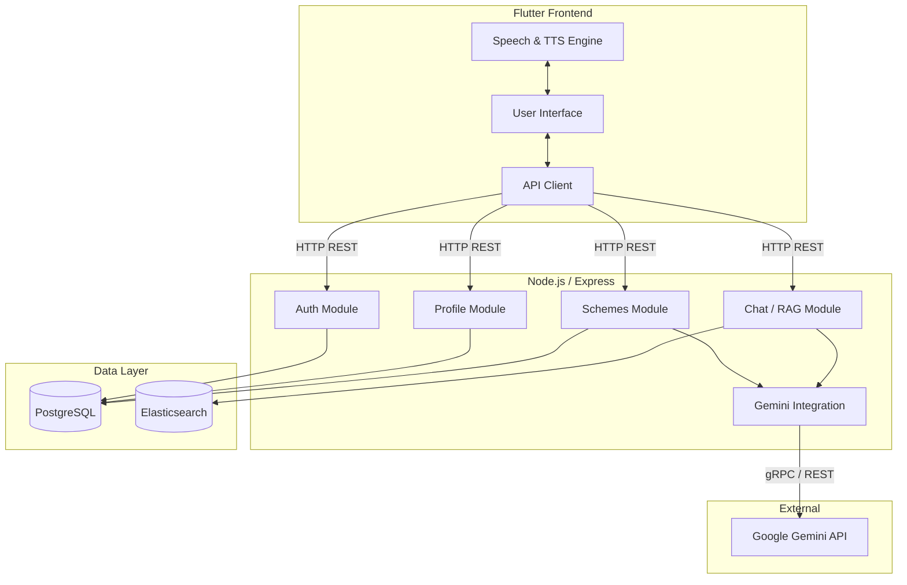

# Sarkari Mitra 🇮🇳

An AI-powered mobile application designed to bridge the gap between Indian citizens and government welfare schemes.

## The Real World Problem 🚨
India has hundreds of active government schemes (Yojanas) at both the central and state levels designed to help citizens with agriculture, education, healthcare, and financial security. However, millions of eligible citizens fail to benefit from these programs due to:
1. **Information Asymmetry**: Schemes are scattered across various portals, making them hard to discover.
2. **Complex Eligibility Criteria**: Understanding who qualifies for what is often convoluted.
3. **Language Barriers**: Most official documentation is heavily rooted in English or complex formal Hindi.
4. **Digital Literacy**: Marginalized communities often struggle to navigate complex web forms.

## Our Solution 💡
**Sarkari Mitra** (Government Friend) is a voice-first, multilingual, AI-powered mobile assistant that democratizes access to government schemes. 
- **Personalized Recommendations**: Users create a simple profile (age, income, state, caste, occupation), and the system filters the exact schemes they are eligible for.
- **AI Chat & Voice**: Users can simply tap a microphone and ask (in English or Hindi) about schemes. The AI responds via Text-to-Speech (TTS), eliminating the need for reading complex documents.
- **Real-time Translation**: Leveraging Google's Gemini AI, scheme details are translated natively on-the-fly to the user's preferred language.

## Tech Stack 🛠️

### Frontend (Mobile App)
* **Framework**: Flutter (Dart)
* **State Management**: Riverpod
* **Accessibility**: `flutter_tts` (Text-to-Speech), `speech_to_text` (Dictation)
* **UI Architecture**: Component-based, modern Material UI

### Backend (API Server)
* **Runtime**: Node.js with Express & TypeScript
* **Database ORM**: Prisma
* **Primary Database**: PostgreSQL (Stores users, profiles, and basic scheme metadata)
* **Search Engine**: Elasticsearch (Vector DB for RAG & Semantic Search)
* **AI Provider**: Google Gemini (gemini-2.5-flash) - Handles embeddings, natural language chat, and translation.

## Architecture Diagram 🏗️



## Getting Started 🚀

### Backend Setup
```bash
npm install
copy .env.example .env
npm run prisma:generate
npm run prisma:migrate:dev
npm run dev
```

Use a strong random `JWT_SECRET` in every deployed environment.
Set `TRUST_PROXY_HOPS` only when the API is behind a trusted reverse proxy.
Disable public API documentation in production with `SWAGGER_ENABLED=false` unless access is restricted at the gateway.

**API Endpoints Overview:**
- `GET /health/live`
- `GET /health/ready`
- `GET /api-docs`
- `POST /api/v1/auth/register`
- `POST /api/v1/auth/login`
- `GET /api/v1/auth/me`

### Frontend Setup
1. Navigate to the `frontend/` directory.
2. Run `flutter pub get`.
3. Ensure your emulator or physical device is connected.
4. Run `flutter run`.

## License
MIT License
