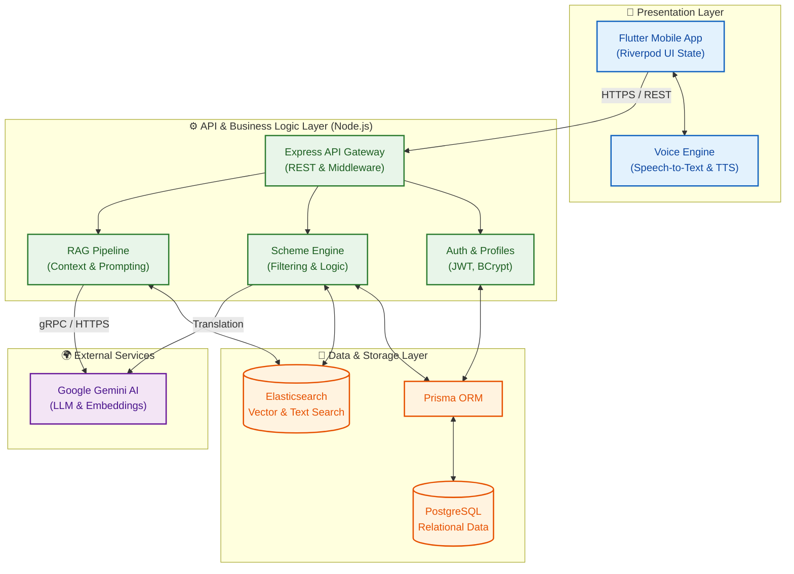

<div align="center">
  <h1>🏛️ Sarkari Mitra 🇮🇳</h1>
  <p><strong>Bridging the gap between Indian citizens and government welfare schemes through AI.</strong></p>
</div>

<br />

## 📖 Overview

India has hundreds of active government schemes (Yojanas) at both the central and state levels. However, millions of eligible citizens fail to benefit from these programs due to information asymmetry, complex eligibility criteria, language barriers, and a lack of digital literacy.

**Sarkari Mitra** (Government Friend) solves this problem by providing a voice-first, multilingual, AI-powered mobile assistant. It democratizes access to government schemes by personalizing recommendations and providing conversational AI support in native regional languages.

## ✨ Key Features

- 🎯 **Personalized Eligibility Engine**: Users enter a simple demographic profile (age, income, state, caste, occupation) and receive precisely matched scheme recommendations.
- 🎙️ **Voice-First AI Chatbot**: Built-in dictation (Speech-to-Text) and Text-to-Speech (TTS) allows users to ask questions naturally without navigating complex menus.
- 🌐 **Real-Time Translation**: Powered by Google's Gemini AI, all complex government terminology and scheme details are translated on-the-fly into the user's preferred language (e.g., Hindi).
- 🔍 **Semantic Search (RAG)**: Leverages Elasticsearch and Vector Embeddings to provide highly accurate answers to user queries based strictly on official scheme documents.

---

## 🏗️ System Architecture

The platform follows a modern, decoupled microservices-inspired architecture designed for scalability and high performance.



---

## 🛠️ Technology Stack

| Layer | Technologies |
| :--- | :--- |
| **Frontend** | Flutter (Dart), Riverpod, Material 3, flutter_tts, speech_to_text |
| **Backend** | Node.js, Express.js, TypeScript, Zod |
| **Database** | PostgreSQL, Prisma ORM |
| **Search Engine** | Elasticsearch (BM25 + Vector Search) |
| **AI / ML** | Google Gemini (gemini-2.5-flash) |
| **Security** | JWT, BCrypt, Express Rate Limiter |

---

## 🚀 Getting Started

Follow these steps to set up the project locally for development and testing.

### Prerequisites
- [Node.js](https://nodejs.org/) (v18 or higher)
- [Flutter SDK](https://docs.flutter.dev/get-started/install) (v3.19 or higher)
- [PostgreSQL](https://www.postgresql.org/)
- [Elasticsearch](https://www.elastic.co/elasticsearch/)
- A Google Gemini API Key

### 1. Backend Setup

1. Navigate to the backend directory:
   ```bash
   cd backend
   ```
2. Install dependencies:
   ```bash
   npm install
   ```
3. Configure the environment variables:
   ```bash
   cp .env.example .env
   ```
   *Edit `.env` to include your `DATABASE_URL`, `ELASTICSEARCH_NODE`, and `GEMINI_API_KEY`.*
4. Initialize the database schema:
   ```bash
   npm run prisma:generate
   npm run prisma:migrate:dev
   ```
5. Start the development server:
   ```bash
   npm run dev
   ```
   *The API will be available at `http://localhost:5000`.*

### 2. Frontend (Mobile) Setup

1. Open a new terminal and navigate to the frontend directory:
   ```bash
   cd frontend
   ```
2. Install Flutter packages:
   ```bash
   flutter pub get
   ```
3. Ensure you have a connected device (Android/iOS emulator or physical device).
4. Run the application:
   ```bash
   flutter run
   ```

---

## 🔒 Security Best Practices
- **Production Environment**: Ensure you use a strong, cryptographically secure `JWT_SECRET`.
- **API Documentation**: Disable Swagger UI in production by setting `SWAGGER_ENABLED=false` unless access is explicitly restricted at your API Gateway.
- **Proxy Configuration**: Set `TRUST_PROXY_HOPS` only if the application is running behind a trusted reverse proxy (e.g., NGINX, Render, AWS ALB).

## 📄 License
This project is licensed under the MIT License.
